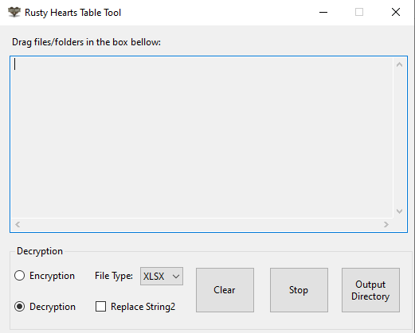

# Rusty Hearts Table Tool

 <a href="https://github.com/JuniorDark/RustyHearts-TableTool/releases">

A C# Windows Forms application to convert and encrypt/decrypt the Rusty Hearts game table files (.rh).

## Preview

## Getting Started
To get started with this tool, simply download the latest release from the GitHub repository.

## Formats
The Rusty Hearts Table Tool supports two output formats:
- **XML**: Extensible Markup Language - 2 Output formats
- **XLSX** Microsoft Excel Spreadsheet

## Usage
1. Select the "Encrypt" or "Decrypt" radio button.
2. Select the file type of you want to use (XLSX or XML).
3. Select the Input folder or Drag and drop the files/folder you want to process in the text box.
4. Click the Start button to start the process, once the process is complete, the files will be saved in the selected "Output" folder.
If a file fail to process it will be logged to error.log.

## Prerequisites for Development
* Visual Studio 2022 (Any Edition - 17.12 or later)
* Windows 10 SDK or Windows 11 SDK via Visual Studio Installer
* .NET Core 9 SDK (9.0.100 or later)

## Building

If you wish to build the project yourself, follow these steps:

### Step 1

Install the [.NET 9.0 (or higher) SDK](https://dotnet.microsoft.com/download/dotnet/9.0).
Make sure your SDK version is higher or equal to the required version specified. 

### Step 2

Either use `git clone https://github.com/JuniorDark/RustyHearts-TableTool` on the command line to clone the repository or use Code --> Download zip button to get the files.

### Step 3

To build the project, open a command prompt inside the project directory.
You can quickly access it on Windows by holding shift in File Explorer, then right clicking and selecting `Open command window here`.
Then type the following command: `dotnet build -c Release`.
 
The built files will be found in the newly created `bin` build directory.

## License
This project is licensed under the terms found in [`LICENSE-0BSD`](LICENSE).

## Credits
The following third-party libraries are used in this project:
* [EPPlus](https://www.nuget.org/packages/EPPlus)
