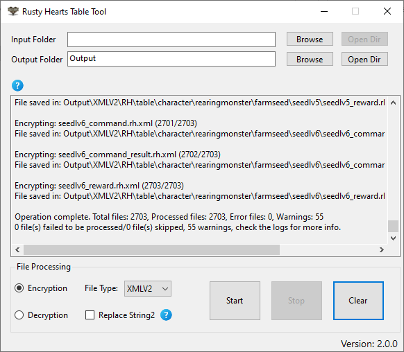

# Rusty Hearts Table Tool

 <a href="https://github.com/JuniorDark/RustyHearts-TableTool/releases">

A C# Windows Forms application to encrypt/decrypt the Rusty Hearts game table files (.rh files).

## Getting Started
To get started with this tool, simply download the latest release from the GitHub repository.

## Formats
The Rusty Hearts Table Tool supports two output formats:

- **XML**: 
- **XLSX**:

## Usage
1. Select the "Encrypt" or "Decrypt" radio button.
2. Select the file type of you want to use (XLSX or XML).
3. Drag and drop the files you want to encrypt or decrypt in the text box.
4. Once the process is complete, the files will be saved in the "Output" folder in the program directory.

## Prerequisites for Building Locally/Development
The tool is built in .NET 7 and as such, the packages listed below are required to create a local and development build of the launcher. Furthermore, it uses many submodules and packages outside of this, which will automatically be loaded when the user sets up a local environment of the application.
* Visual Studio 2022 (Any Edition - 17.4 or later)
* Windows 10 SDK (10.0.19043.0) or Windows 11 SDK (10.0.22000.0) via Visual Studio Installer
* .NET: [.NET Core 7 SDK (7.0.100 or later)](https://dotnet.microsoft.com/en-us/download/dotnet/7.0)

## System Requirements for Ready-to-use build
* OS: Windows 10 1809 Update (build 17763) or later / Windows 11 (Any builds)
* Architecture: x64/AMD64

## Preview

## License
This project is licensed under the terms found in [`LICENSE-0BSD`](LICENSE).

## Contributing
Contributions from the community are welcome! If you encounter a bug or have a feature request, please submit an issue on GitHub. If you would like to contribute code, please fork the repository and submit a pull request.

## FAQ
* Q: How do I report a bug?
  * A: Please submit an issue on GitHub with a detailed description of the bug and steps to reproduce it.
* Q: How do I request a new feature?
  * A: Please submit an issue on GitHub with a detailed description of the feature and why it would be useful.
* Q: How do I contribute code?
  * A: Please fork the repository, make your changes, and submit a pull request.

## Credits
The following third-party libraries, tools, and resources are used in this project:
* [EPPlus](https://www.nuget.org/packages/EPPlus)

## Support
If you need help with the tool, please submit an issue on GitHub.
